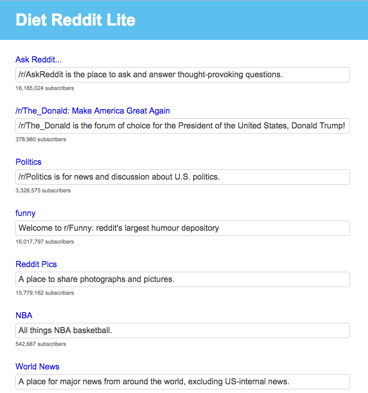
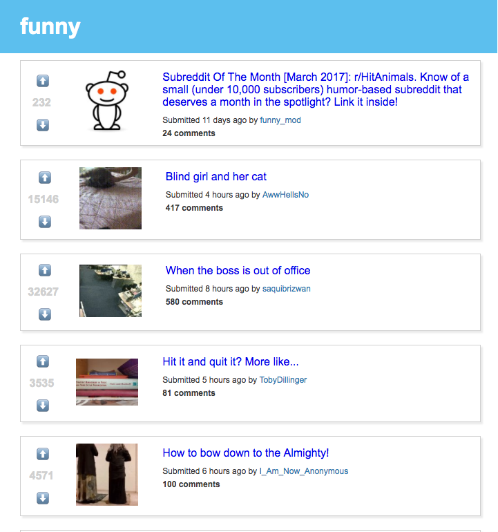

# Diet Reddit Lite
A super scaled-down version of Reddit that automatically pings Reddit's data every minute without losing scroll position or refreshing page.The user can navigate to any subreddit and view a list of 25 posts. Clicking on the post will show a basic post page or allow you to navigate to the external link.

## Getting Started
Make sure you have [Node.js](https://nodejs.org/en/) installed, and run:

`$ npm install`

`$ npm start`

Your app should now be running on [localhost:3000](http://localhost:3000/).

## Running the tests
Currently only checks that the home page component mounts on startup.

`$ npm test`

## Updating Styles

The following command will watch for changes to all Sass files:

`$ npm run watch-css`

Upon saving, `build-css` runs and recompiles your updated Sass to main.css.

## Built With
* React.js
* Node.js
* Sass
* Fetch API
* Reddit API
* Webpack
* React Router
* Mocha
* Chai
* Sinon
* Enzyme

## Author
* Kim Hart
